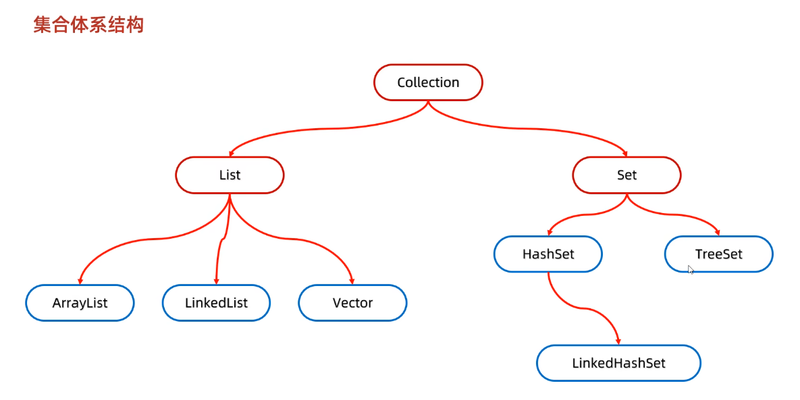

# Java 集合学习文档

## 一、集合框架概述

Java 集合框架（Java Collections Framework，JCF）是用来存储和操作对象组的类库，主要包含以下几大体系：

* **Collection 接口**：存储单列元素

    * **List**（有序、可重复）
    * **Set**（无序、不重复）
    * **Queue/Deque**（队列/双端队列，支持 FIFO/LIFO）
* **Map 接口**：存储键值对（key-value），key 唯一。



集合框架主要位于 `java.util` 包中。

---

## 二、集合体系结构

### 1. Collection 接口

* **List**

    * **ArrayList**：基于动态数组，查询快（O(1)），插入/删除慢（O(n)）。
    * **LinkedList**：基于双向链表，插入/删除快（O(1)），查询慢（O(n)）。
    * **Vector**：线程安全的动态数组，性能低（已不推荐）。

* **Set**

    * **HashSet**：基于 `HashMap` 实现，无序，不重复，查询快。
    * **LinkedHashSet**：在 HashSet 基础上维护插入顺序。
    * **TreeSet**：基于红黑树，元素有序（自然排序或自定义 Comparator）。

* **Queue/Deque**

    * **PriorityQueue**：基于堆实现的优先级队列，按优先级排序。
    * **ArrayDeque**：双端队列，可作为栈或队列使用，效率比 Stack 高。

### 2. Map 接口

* **HashMap**：基于数组 + 链表 + 红黑树（JDK 8+），线程不安全，允许 null 键和 null 值。
* **LinkedHashMap**：在 HashMap 基础上维护插入顺序或访问顺序。
* **TreeMap**：基于红黑树，按 key 排序，不允许 null 键。
* **Hashtable**：线程安全，效率低，不允许 null 键/值。
* **ConcurrentHashMap**：线程安全，分段锁或 CAS 实现（JDK 8 之后基于桶 + 红黑树）。

---

## 三、集合特性总结

| 类型                | 是否有序 | 是否允许重复  | 是否线程安全 | 底层实现结构         |
|-------------------|------|---------|--------|----------------|
| ArrayList         | 有序   | 允许      | 否      | 动态数组           |
| LinkedList        | 有序   | 允许      | 否      | 双向链表           |
| Vector            | 有序   | 允许      | 是      | 动态数组           |
| HashSet           | 无序   | 不允许     | 否      | HashMap        |
| LinkedHashSet     | 有序   | 不允许     | 否      | HashMap + 双向链表 |
| TreeSet           | 排序   | 不允许     | 否      | 红黑树            |
| HashMap           | 无序   | key 不重复 | 否      | 数组 + 链表/红黑树    |
| LinkedHashMap     | 有序   | key 不重复 | 否      | HashMap + 双向链表 |
| TreeMap           | 排序   | key 不重复 | 否      | 红黑树            |
| Hashtable         | 无序   | key 不重复 | 是      | 数组 + 链表        |
| ConcurrentHashMap | 无序   | key 不重复 | 是      | 分段锁/CAS        |

---

## 四、示例代码

### 1. ArrayList 示例

```java
List<String> list = new ArrayList<>();
list.add("A");
list.add("B");
list.add("C");
System.out.println(list.get(1)); // B
```

### 2. HashSet 示例

```java
Set<String> set = new HashSet<>();
set.add("A");
set.add("B");
set.add("A"); // 重复元素不会存储

System.out.println(set); // [A, B]
```

### 3. HashMap 示例

```java
Map<Integer, String> map = new HashMap<>();
map.put(1,"Tom");
map.put(2,"Jerry");
map.put(1,"Spike"); // 覆盖 key=1 的值

System.out.println(map); // {1=Spike, 2=Jerry}
```

---

## 五、面试常见考点

1. **List 和 Set 的区别？**

    * List：有序，可重复。
    * Set：无序，不可重复。

2. **HashMap 和 Hashtable 的区别？**

    * HashMap：线程不安全，允许 null 键和 null 值，效率高。
    * Hashtable：线程安全，不允许 null 键和值，效率低。

3. **HashMap 的底层原理？**

    * JDK 1.7：数组 + 链表。
    * JDK 1.8：数组 + 链表 + 红黑树（当链表长度超过 8 时转红黑树）。

4. **ArrayList 和 LinkedList 的区别？**

    * ArrayList：基于动态数组，查询快，插入删除慢。
    * LinkedList：基于双向链表，插入删除快，查询慢。

5. **ConcurrentHashMap 为什么效率高？**

    * JDK 1.7：分段锁机制。
    * JDK 1.8：CAS + synchronized 锁粒度更小，性能更优。

6. **如何实现一个线程安全的集合？**

    * 使用 `Collections.synchronizedList()` 包装。
    * 使用并发包中的类，例如 `ConcurrentHashMap`、`CopyOnWriteArrayList`。

---

## 六、典型面试题

1. **你在项目中使用过哪些集合？为什么选择它们？**

    * （考察候选人是否能结合实际场景说明，比如：查询多用 ArrayList，去重多用 HashSet，需要排序用 TreeMap。）

2. **HashMap 的负载因子（loadFactor）有什么用？默认值是多少？**

    * 默认 `0.75`，表示当哈希表容量达到 75% 时会触发扩容，折中时间和空间效率。

3. **HashMap 在多线程下会发生什么问题？**

    * 数据丢失、覆盖、死循环（JDK 1.7 扩容时）。

4. **为什么 HashMap 的链表转红黑树阈值是 8？**

    * 因为红黑树比链表复杂，在节点较少时链表效率更高，超过 8 时转红黑树提高查询效率。

---

# 总结

* **List**：顺序存储，可重复。
* **Set**：无序存储，不重复。
* **Map**：键值对存储，key 唯一。
* **面试重点**：HashMap、ConcurrentHashMap、ArrayList、LinkedList 的区别和底层原理。
